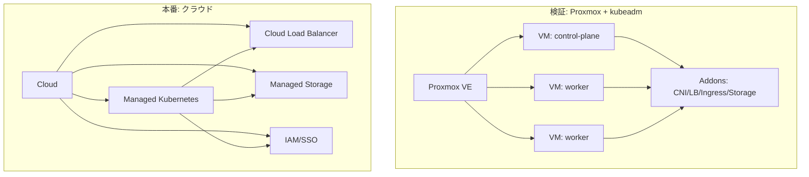

# 第1章：Proxmox / Podman / Kubernetes の関係俯瞰

## この章の学習目標（3〜5）

- Proxmox / Podman / containerd / Kubernetes の責務と境界を説明できる
- 開発端末/CI と Kubernetes ノード上で使うコンポーネントを切り分けられる
- 「検証→本番」で差分が出る箇所を俯瞰できる

## なぜ俯瞰が必要か

本書は「Proxmox での検証」から「クラウドでの本番」へ移すことを前提にしています。
このとき、単に Kubernetes の手順を追うだけでは、次のような誤解が発生します。

- どの責務がどのレイヤ（仮想化/OS/ランタイム/Kubernetes/アドオン）に属するかが曖昧になる
- 検証環境固有の都合（例: MetalLB、ストレージ構成）を本番へそのまま持ち込もうとして破綻する
- Podman/Docker/containerd を同列に扱い、運用設計（再現性/監査性/更新）に必要な境界が作れない

本章では、用語と責務を最初に固定します。

## 責務の整理（最小）

| 要素 | 主な責務 | 典型的な配置 |
| --- | --- | --- |
| Proxmox VE | 仮想化基盤（VM/ネットワーク/ストレージの提供） | 検証（オンプレ） |
| VM（Linux） | OS、カーネル、基本ツール | 検証（Proxmox上） |
| Kubernetes | 宣言的なリソース管理、スケジューリング、制御 | 検証/本番 |
| kubelet | ノード上で Pod を実行するためのノードエージェント | K8sノード |
| containerd | コンテナ実行（CRI経由で利用されることが多い） | K8sノード |
| Podman/Docker | コンテナイメージの build/push、開発・CIでのコンテナ利用 | 開発端末/CI |

注記: 本書では、Kubernetes ノード上の実行系（runtime）と、開発/CI の build 系（engine）を分けて扱います。

## OCI と CRI の位置づけ

Kubernetes の「コンテナ実行」は、主に次の境界で分割されます。

- OCI（Open Container Initiative）: コンテナ「イメージ形式」や「ランタイム」の仕様
- CRI（Container Runtime Interface）: kubelet がコンテナランタイムとやり取りするためのインターフェース

実務上のポイントは、kubelet は CRI を通して runtime を呼ぶことです。
そのため、検証→本番で再現性を上げたい場合は、ノード側の runtime（例: containerd）の扱いを「OS/設定/アップグレード手順」まで含めて設計対象にします。

### Docker と Kubernetes（dockershim の扱い）

Kubernetes は以前、Docker Engine を直接扱う仕組み（dockershim）を含んでいましたが、dockershim は **Kubernetes v1.24 で削除済み** です。
そのため、ノード上の runtime は CRI 準拠（例: containerd）を前提にします。

一方で、Docker/Podman は **コンテナイメージの build/push 用途** としては引き続き有効です。
「ノード runtime（実行）」と「開発/CI の build（生成）」を混同しないことが、検証→本番での再現性と運用設計に直結します。

## Podman の位置づけ（本書の前提）

Podman は、開発端末や CI で次の用途に使えます。

- コンテナイメージの build / tag / push
- ローカル検証（単体実行）

一方で、Kubernetes ノードの runtime として Podman を採用する設計は本書のスコープ外とし、ノード側は CRI 対応 runtime（例: containerd）を前提に進めます。

## Proxmox の位置づけ

Proxmox VE は Kubernetes の外側にある仮想化基盤です。役割は次の通りです。

- 検証用に「複数ノード（VM）」を用意する
- ネットワークとストレージの検証条件をコントロールする
- 破壊的操作（再構築/ロールバック）を現実的なコストで行えるようにする

## 検証（Proxmox）と本番（クラウド）の差分が出る箇所

検証→本番で差分が出やすい領域（＝先に設計しておくべき領域）は次です。

- Load Balancer（検証: MetalLB 等 / 本番: クラウドLB）
- Storage（検証: ローカル/分散 / 本番: マネージド or CSI）
- Identity（検証: 最小構成 / 本番: IAM/SSO 連携）
- Observability（検証: 簡易 / 本番: 組織標準の監視・ログ基盤）

## 図1：責務とデータフロー（概念）

```mermaid
flowchart LR
  Dev[開発端末/CI] -->|build/push| Reg[Container Registry]
  Reg -->|pull| Node[K8s Node]

  Proxmox[Proxmox VE] --> VM[VM (Linux)]
  VM --> Node

  CP[Kubernetes Control Plane] --> Kubelet[kubelet]
  Kubelet -->|CRI| Runtime[containerd 等]
  Runtime -->|OCI runtime| Containers[Containers]
  Node --> Containers
```

## 図2：アーキテクチャ比較（検証 vs 本番）



## 公式ドキュメント（参照）

- Kubernetes: Container Runtimes（CRI/ランタイム）: https://kubernetes.io/docs/setup/production-environment/container-runtimes/
- Kubernetes Blog: dockershim removal FAQ: https://kubernetes.io/blog/2022/02/17/dockershim-faq/
- OCI（仕様）: https://opencontainers.org/
- containerd（公式）: https://containerd.io/
- Podman（公式）: https://podman.io/

## まとめ

本章は「責務の境界」を明確化し、検証と本番の差分を前提にした学習の土台を作ります。

## 章末チェックリスト（3〜10）

- [ ] Proxmox / Podman / containerd / Kubernetes の責務を区別できる
- [ ] Kubernetes ノード上で必要な要素と、開発端末/CI 側の要素を切り分けられる
- [ ] 検証→本番で差分が出る領域（LB/Storage 等）を説明できる
