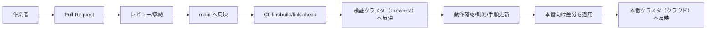
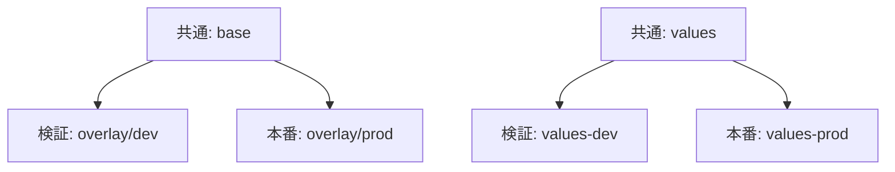

# 第2章：検証→本番を現実的にする設計原則

## この章の学習目標（3〜5）

- 検証→本番の移行を成立させる前提（IaC/GitOps/差分抽象化）を説明できる
- Kustomize→Helm の学習順の合理性を説明できる
- 「やること/やらないこと」の結論を、運用要件から判断できる

## 検証→本番を「現実的」にするとは

本書でいう「現実的」とは、次の要件を満たす状態です。

- 検証で得た知見が、本番で再利用できる（手順・設定・判断基準が残る）
- 本番への移行で差分が出る箇所が、事前に可視化されている（設計の想定内）
- 変更が監査可能で、ロールバックできる（人・プロセス・仕組みが揃う）

## 前提（3点セット）

### 1. IaC（クラウド側）

クラウド側の基盤（ネットワーク、ID、ストレージ、LB 等）は、原則として IaC で管理します。
理由は、検証→本番の差分が「人手の設定差」になりやすいためです。

### 2. GitOps（Kubernetes側）

Kubernetes リソースは Git を単一のソースにし、差分は Pull Request でレビューできる形にします。
これにより、検証・本番どちらの環境でも「何が変わったか」が説明可能になります。

### 3. 差分の抽象化（LB/Storage/Ingress 等）

検証→本番で差分が出る領域は、最初から差分として扱います。
差分を無視して先に進むと、後から全面改修になります（コストが跳ね上がる）。

## 差分の分類（何を揃えて、何を分けるか）

| 分類 | 原則 | 例 |
| --- | --- | --- |
| できるだけ揃える | アプリの「意図」を揃える | Namespace、ラベル設計、Deployment の構造、リソース制限、Config の論理構造 |
| 最初から分ける | 環境依存の前提は分ける | StorageClass、LB/Ingress の方式、ID連携、監視/ログの集約先 |

## Kustomize→Helm の学習順（理由）

本書では、次の順序を推奨します。

- Kustomize: 差分（overlay）を小さく安全に表現する。Kubernetes のリソース構造の理解に直結する
- Helm: パッケージ運用（Chart/values）と release 管理（upgrade/rollback）をスケールさせる

順序を逆にすると、テンプレートの複雑さに引きずられて「何がKubernetesの本質的な差分か」を見失いやすくなります。

## やること / やらないこと（結論）

### やること

- マニフェストの同一性を最大化し、差分は values/overlays に寄せる
- 検証で実行した作業を、再現可能な形（手順/設定/理由）で残す
- 破壊的操作の停止線（影響範囲/復旧/バックアップ）を手順に組み込む

### やらないこと

- 検証の都合で、本番の特定機能へ過度に依存する（後で差し替え不能になる）
- 手順をスクリプト化して「理由が読めない黒魔術」にする

## 図1：検証→本番の昇格（promotion）モデル（概念）

## 図2：差分吸収（base + overlays / values）（概念）

## 公式ドキュメント（参照）

- Kustomize（公式）: https://kubectl.docs.kubernetes.io/references/kustomize/
- Helm（公式）: https://helm.sh/docs/
- Argo CD（GitOps例）: https://argo-cd.readthedocs.io/
- Flux（GitOps例）: https://fluxcd.io/

## まとめ

本章は「検証を本番へ繋げるための設計原則」を先に確定し、以後の章の判断基準にします。

## 章末チェックリスト（3〜10）

- [ ] 検証→本番を成立させる前提（IaC/GitOps/差分抽象化）を説明できる
- [ ] Kustomize→Helm の学習順の意図を理解した
- [ ] 検証で本番依存へ寄せすぎない方針を確認した
