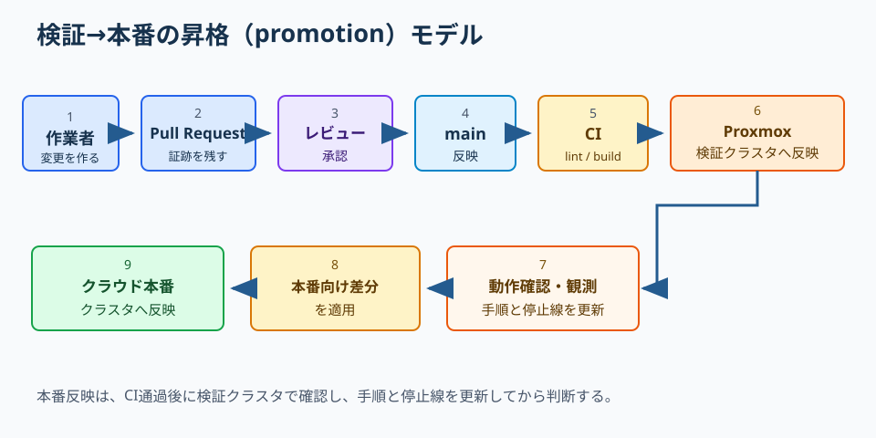
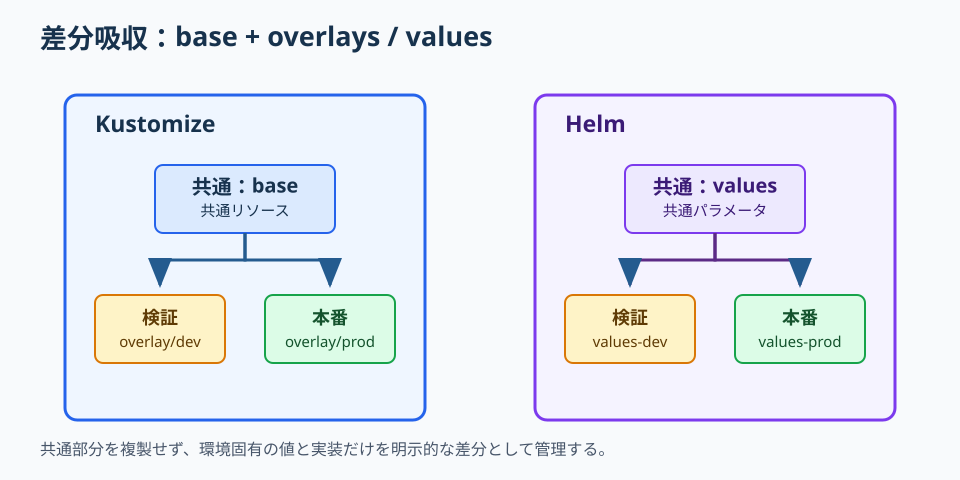

# 第2章：検証→本番を現実的にする設計原則

## この章の学習目標（3〜5）

- 検証→本番の移行を成立させる前提（IaC/GitOps/差分抽象化）を説明できる
- Kustomize→Helm の学習順の合理性を説明できる
- 「やること/やらないこと」の結論を、運用要件から判断できる

## 検証→本番を「現実的」にするとは

本書でいう「現実的」とは、次の要件を満たす状態です。

- 検証で得た知見が、本番で再利用できる（手順・設定・判断基準が残る）
- 本番への移行で差分が出る箇所が、事前に可視化されている（設計の想定内）
- 変更が監査可能で、ロールバックできる（人・プロセス・仕組みが揃う）

## 前提（3点セット）

### 1. IaC（クラウド側）

クラウド側の基盤（ネットワーク、ID、ストレージ、LB 等）は、原則として IaC で管理します。
理由は、検証→本番の差分が「人手の設定差」になりやすいためです。

### 2. GitOps（Kubernetes側）

Kubernetes リソースは Git を単一のソースにし、差分は Pull Request でレビューできる形にします。
これにより、検証・本番どちらの環境でも「何が変わったか」が説明可能になります。

### 3. 差分の抽象化（LB/Storage/Ingress 等）

検証→本番で差分が出る領域は、最初から差分として扱います。
差分を無視して先に進むと、後から全面改修になります（コストが跳ね上がる）。

## 差分の分類（何を揃えて、何を分けるか）

| 分類 | 原則 | 例 |
| --- | --- | --- |
| できるだけ揃える | アプリの「意図」を揃える | Namespace、ラベル設計、Deployment の構造、リソース制限、Config の論理構造 |
| 最初から分ける | 環境依存の前提は分ける | StorageClass、LB/Ingress の方式、ID連携、監視/ログの集約先 |

## 移行計画の判断例（最小）

ここでは「検証→本番」を進める際の判断例を、最小の形で示します。実際の要件（停止許容、データ保全、監査要件等）により最適解は変わります（要確認）。

### 例: 3種類のワークロードをクラウドへ段階移行する

| 種別 | 典型の移行方針（例） | 先に決めること（例） |
| --- | --- | --- |
| Stateless（API/フロント） | 旧環境と並行稼働し、Ingress/DNS で切替 | 切替方式（段階/一括）、ロールバック手順 |
| Stateful（DB/キュー） | データ移行を別計画にし、切替窓と復旧手段を固定 | RPO/RTO、バックアップ/復元演習、整合性確認 |
| Batch/Job | 新環境で先行実行し、出力と性能を比較 | 再実行戦略、実行スケジュール/権限 |

進め方（最小）:

1. 対象を棚卸しし、「同一化できるもの/置換するもの」を分類する（本章の差分分類を使う）
2. 置換ポイント（LB/Ingress/Storage/Identity）を先に分離し、overlay/values の責務として固定する
3. ロールバックの停止線を決める（例: 切替後の一定時間は旧環境へ戻せる、等）
4. 切替前後の検証観点をチェックリスト化する（付録の [トラブルシューティング](../../appendices/troubleshooting/) を参照）

## Kustomize→Helm の学習順（理由）

本書では、次の順序を推奨します。

- Kustomize: 差分（overlay）を小さく安全に表現する。Kubernetes のリソース構造の理解に直結する
- Helm: パッケージ運用（Chart/values）と release 管理（upgrade/rollback）をスケールさせる

順序を逆にすると、テンプレートの複雑さに引きずられて「何がKubernetesの本質的な差分か」を見失いやすくなります。

## やること / やらないこと（結論）

### やること

- マニフェストの同一性を最大化し、差分は values/overlays に寄せる
- 検証で実行した作業を、再現可能な形（手順/設定/理由）で残す
- 破壊的操作の停止線（影響範囲/復旧/バックアップ）を手順に組み込む

### やらないこと

- 検証の都合で、本番の特定機能へ過度に依存する（後で差し替え不能になる）
- 手順をスクリプト化して、判断基準や前提が読めない状態にする（属人化・監査不能につながる）

## 図3：検証→本番の昇格（promotion）モデル（概念）

<figure id="figure-03-promotion-model">
  
  <figcaption>図3：検証→本番の昇格（promotion）モデル（概念）。<a href="../../appendices/figure-index/#figure-03-promotion-model">目的と確認観点は図表索引を参照</a>。</figcaption>
</figure>

## 図4：差分吸収（base + overlays / values）（概念）

<figure id="figure-04-configuration-differences">
  
  <figcaption>図4：差分吸収（base + overlays / values）（概念）。<a href="../../appendices/figure-index/#figure-04-configuration-differences">目的と確認観点は図表索引を参照</a>。</figcaption>
</figure>

## 公式ドキュメント（参照）

- [Kustomize（公式）](https://kubectl.docs.kubernetes.io/references/kustomize/)
- [Helm（公式）](https://helm.sh/docs/)
- [Argo CD（GitOps例）](https://argo-cd.readthedocs.io/)
- [Flux（GitOps例）](https://fluxcd.io/)

## まとめ

本章は「検証を本番へ繋げるための設計原則」を先に確定し、以後の章の判断基準にします。

## 章末チェックリスト（3〜10）

- [ ] 検証→本番を成立させる前提（IaC/GitOps/差分抽象化）を説明できる
- [ ] Kustomize→Helm の学習順の意図を理解した
- [ ] 検証で本番依存へ寄せすぎない方針を確認した
