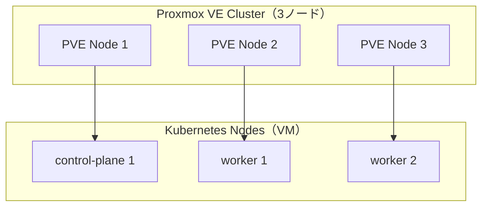

# 第3章：Proxmox VE 3ノード検証基盤

## この章の学習目標（3〜5）

- 3ノード検証基盤の設計観点（ネットワーク/ストレージ/VM設計）を整理できる
- 検証環境でやるべきこと（再現性/自動化）と、やりすぎないことを区別できる
- 以後の Kubernetes 構築で詰まりやすい前提条件を把握できる

## 注意（破壊的操作）

Proxmox/VM/ストレージの設定変更は破壊的操作を含む可能性があります。実行前にバックアップと影響範囲を確認してください。

## 前提とスコープ（本章で扱う範囲）

- Proxmox VE は **検証用の仮想化基盤** として扱います（Proxmox を Kubernetes の代替にしません）
- 本章は Proxmox VE の全機能を網羅しません（検証→本番へ繋げるための最小設計に絞ります）
- Kubernetes ノードは VM（Linux）として作成し、第4章で `kubeadm + containerd` によりクラスタ構築します

## 検証用 と 本番用 の判断線（先に決める）

検証環境は「壊して戻せる」ことが価値ですが、同時に「本番へ持ち込めない最適化」をすると移行で詰みます。
本書では次を判断線にします。

| 領域 | 検証（Proxmox）でやる | 本番（クラウド）で置き換える/やらない |
| --- | --- | --- |
| ノード台数/役割 | control-plane 1 + worker 2（最小） | control-plane HA、AZ 分散などはクラウド設計に従う |
| ネットワーク | 管理/VMネットを分離し、到達性と名前解決を固定 | LB/Ingress の実装はクラウド標準へ置換 |
| ストレージ | 検証の現実解（local/NFS 等）で PV を動かす | クラウド CSI（EBS/EFS 等）へ置換 |
| HA | 「障害時の手順」を検証する目的で扱う | Proxmox HA でアプリ HA を作らない（K8s/クラウドで担保） |
| 自動化 | cloud-init 等で “同じ VM を作れる” を担保 | IaC/GitOps へ昇格（第11章） |

## 3ノード最小構成の考え方（quorum/運用）

Proxmox のクラスタは quorum（多数決）で成立します。
3ノード構成は「2ノード生存で意思決定できる」ため、検証環境の停止線（どこまで落ちても運用できるか）を作りやすい最小構成です。

2ノード構成は split-brain（相互に正だと判断する分断）を避けるために追加の設計（例: qdevice）が必要になり、検証の主目的から外れやすいため、本書では扱いません。

## 図：検証環境のレイヤ（概念）



## Proxmox クラスタ作成（最小手順）

クラスタ作成のコマンド例です（詳細は公式ドキュメントを参照してください）。

```bash
# node-1（最初の1台で実行）
sudo pvecm create lab-pve

# node-2 / node-3（node-1 の管理IPへ参加）
sudo pvecm add 10.0.10.11

# quorum 確認（どのノードでも可）
sudo pvecm status
```

注意:

- クラスタ名やノード名は後から変えると運用コストが上がります。最初に命名規約を決めてください。
- 参加は管理ネットワーク（後述）で実施し、全ノードの時刻同期が取れていることを前提にします。

## ネットワーク設計例（管理/VMブリッジ/外部公開）

最低限、次の 2 系統を分けます。

- 管理ネットワーク（Proxmox 管理画面/クラスタ通信用）
- VM ネットワーク（Kubernetes ノード VM 用、MetalLB の払い出し元にもなる想定）

例（アドレスは一例）:

| 用途 | CIDR 例 | 主な対象 |
| --- | --- | --- |
| 管理（PVE） | `10.0.10.0/24` | Proxmox UI / pvecm |
| VM（K8sノード） | `10.0.20.0/24` | kubeadm ノード、MetalLB の IP Pool |

`/etc/network/interfaces` の例は `examples/proxmox/network/interfaces.example` に置きます（環境に合わせて NIC 名や VLAN を調整してください）。

## VM 設計例（control-plane 1 + worker 2）

検証の最小構成として、次の分割を推奨します。

| VM | 役割 | vCPU / Mem（目安） | Disk（目安） | 配置（例） |
| --- | --- | --- | --- | --- |
| `k8s-cp1` | control-plane | 2–4 vCPU / 8GB | 40–80GB | PVE Node 1 |
| `k8s-w1` | worker | 2–4 vCPU / 8GB | 40–80GB | PVE Node 2 |
| `k8s-w2` | worker | 2–4 vCPU / 8GB | 40–80GB | PVE Node 3 |

ポイント:

- 「VM を 1 台の Proxmox ノードに集約」すると、障害時の切り分けが難しくなります（検証目的に反するため分散を推奨）
- CPU/メモリは後で増やせますが、ディスク拡張は運用手順が増えるため最初に余裕を持たせます

## cloud-init テンプレート（SSH/時刻同期/名前解決）

検証環境は VM の作り直しが前提です。cloud-init を使い「同じ条件の VM を再作成できる」状態にします。

最低限、次を自動化/固定します。

- SSH 公開鍵（初期ログイン）
- 時刻同期（NTP/chrony 等）
- 名前解決（DNS もしくは `/etc/hosts` の方針）
- `qemu-guest-agent`（IP 表示や操作性のため）

Proxmox CLI（`qm`）で Ubuntu の cloud image をテンプレート化する例を `examples/proxmox/cloud-init/create-ubuntu-template.sh` に置きます。
VM の複製（clone）例は `examples/proxmox/cloud-init/clone-k8s-nodes.sh` を参照してください。

## スナップショット/バックアップ（検証での価値）

検証の価値は「壊して戻す」回転数にあります。次の 2 つを使い分けます。

- スナップショット: 直前状態へ素早く戻す（例: kubeadm 前の状態へ戻す）
- バックアップ: ストレージ障害/誤操作に備えた退避（例: vzdump）

例:

```bash
# VMスナップショット（例: VMID 101）
sudo qm snapshot 101 pre-kubeadm

# バックアップ（例: VMID 101、保存先ストレージは環境依存）
sudo vzdump 101 --mode snapshot --compress zstd
```

## 注意点（やらないこと）

- Proxmox の HA を「Kubernetes の代替」にしない（アプリの可用性は Kubernetes/クラウド側で担保する）
- 検証のために Ceph 等を入れて “本番で使わない運用” を増やさない（学習目的が Ceph の場合は別）
- 手作業の設定変更で進めない（cloud-init/手順書へ落とし、再現性を担保する）

## 公式ドキュメント（参照）

- Proxmox VE Documentation: https://pve.proxmox.com/pve-docs/
- Proxmox Wiki（Cluster Manager / pvecm）: https://pve.proxmox.com/wiki/Cluster_Manager
- Proxmox Wiki（Cloud-Init Support）: https://pve.proxmox.com/wiki/Cloud-Init_Support
- Proxmox Wiki（Backup and Restore）: https://pve.proxmox.com/wiki/Backup_and_Restore

## まとめ

本章は「検証のための Proxmox 設計」を固定し、以後の手順が再現可能に回る状態を作ります。

## 章末チェックリスト（3〜10）

- [ ] ネットワーク/ストレージ/VM の前提を言語化できた
- [ ] 破壊的操作の停止線（バックアップ/影響範囲）を確認した
- [ ] 以後の章で必要な前提条件（到達性/名前解決/時刻同期等）を整理した
